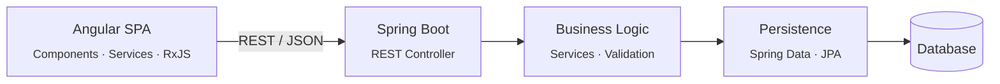
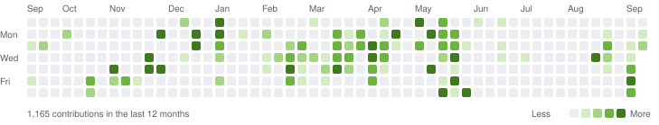
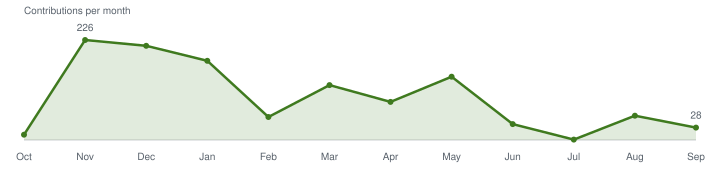

```text
__   __        _
\ \ / /__  ___| |__  _   _
 \ V / _ \/ __| '_ \| | | |
  | |  __/\__ \ | | | |_| |
  |_|\___||___/_| |_|\__,_|

 :: Solutions Engineer ::                             (Enterprise Edition)

INFO  --- [  main] profile.Yeshu  : Starting profile ...
INFO  --- [  main] profile.Yeshu  : Role         -> Solutions Engineer @ mesoneer
INFO  --- [  main] profile.Yeshu  : Backend      -> Java · Spring Boot
INFO  --- [  main] profile.Yeshu  : Frontend     -> Angular · TypeScript
INFO  --- [  main] profile.Yeshu  : Education    -> BSc Computer Science, ZHAW
INFO  --- [  main] profile.Yeshu  : Started profile, ready to connect.
```

[Deutsch](README.md) · **English**

## Profile

I build enterprise applications end to end: robust **Spring Boot** backends and
maintainable **Angular** frontends running in production at large organisations.
I care about clean interfaces, a clear layered architecture and code that stays
easy to understand years later.

## Status

<!-- HEALTH:START -->
```http
GET /actuator/health HTTP/1.1
Host: github.com/Yeshush
```

```json
{
  "status": "UP",
  "components": {
    "backend": {
      "status": "UP",
      "details": {
        "stack": "Java · Spring Boot"
      }
    },
    "frontend": {
      "status": "UP",
      "details": {
        "stack": "Angular · TypeScript"
      }
    },
    "activity": {
      "status": "UP",
      "details": {
        "lastContribution": "2026-09-15",
        "currentStreakDays": 2,
        "longestStreakDays": 6,
        "activeDays": "97 / 367",
        "busiestWeekday": "Monday",
        "bestDay": "2025-12-01 (115 contributions)"
      }
    }
  }
}
```
<!-- HEALTH:END -->

## Architecture I build



## Stack

| Area | Technologies |
|:--|:--|
| **Backend** |   |
| **Frontend** |     |
| **Data & Operations** |   |
| **Also** |     |

## Activity

<picture>
  <source media="(prefers-color-scheme: dark)" srcset="assets/activity-dark.en.svg"/>
  
</picture>

<!-- STATS:START -->
| Contributions (12 months) | Repositories | Contributions 2024 → 2025 → 2026* |
|:---:|:---:|:---:|
| **1,162** | **23** (5 public) | **289 → 643 → 704** |

```text
TypeScript   █████████████████████░░░░░░░░░░░░░░░░░░░░░░░░░░░  43.1 %
PHP          ██████████████░░░░░░░░░░░░░░░░░░░░░░░░░░░░░░░░░░  28.7 %
Python       ████░░░░░░░░░░░░░░░░░░░░░░░░░░░░░░░░░░░░░░░░░░░░   9.3 %
C            ███░░░░░░░░░░░░░░░░░░░░░░░░░░░░░░░░░░░░░░░░░░░░░   5.9 %
JavaScript   ██░░░░░░░░░░░░░░░░░░░░░░░░░░░░░░░░░░░░░░░░░░░░░░   4.8 %
CSS          ██░░░░░░░░░░░░░░░░░░░░░░░░░░░░░░░░░░░░░░░░░░░░░░   4.4 %
Other        ██░░░░░░░░░░░░░░░░░░░░░░░░░░░░░░░░░░░░░░░░░░░░░░   3.8 %
```

<sub>Including private repositories · languages by code size · * 2026 to date · updated automatically on 2026-09-15</sub>
<!-- STATS:END -->

### Trend

<picture>
  <source media="(prefers-color-scheme: dark)" srcset="assets/trend-dark.en.svg"/>
  
</picture>

### Work rhythm

<!-- RHYTHM:START -->
```http
GET /actuator/metrics/commits.hour HTTP/1.1
Host: github.com/Yeshush
```

```text
514 commits · last 12 months · time zone Europe/Zurich

Night       00–06  █░░░░░░░░░░░░░░░░░░░░░░░░░░░░░    4 %
Morning     06–12  █████░░░░░░░░░░░░░░░░░░░░░░░░░   15 %
Afternoon   12–18  ██████████░░░░░░░░░░░░░░░░░░░░   34 %
Evening     18–24  ██████████████░░░░░░░░░░░░░░░░   46 %

Weekdays           ████████████████████████████░░   92 %
Weekend            ██░░░░░░░░░░░░░░░░░░░░░░░░░░░░    8 %

Peak hour: 20:00–21:00
```
<!-- RHYTHM:END -->

## Changelog

<!-- CHANGELOG:START -->
```text
[2026.09]  ▼  contributions    28 · active days  7  (in progress)
[2026.08]  ▲  contributions    55 · active days  5
[2026.07]  ▼  contributions     1 · active days  1
[2026.06]  ▼  contributions    36 · active days  6
[2026.05]  ▲  contributions   143 · active days 16
[2026.04]  ▼  contributions    86 · active days 11
```
<!-- CHANGELOG:END -->

## Contact

[](https://mesoneer.io)
