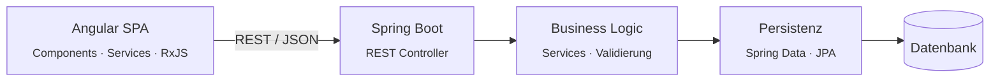
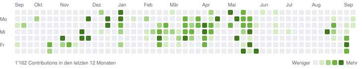
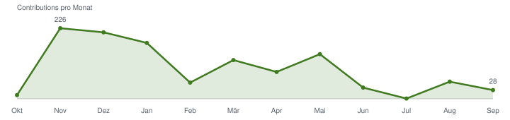

```text
__   __        _
\ \ / /__  ___| |__  _   _
 \ V / _ \/ __| '_ \| | | |
  | |  __/\__ \ | | | |_| |
  |_|\___||___/_| |_|\__,_|

 :: Solutions Engineer ::                             (Enterprise Edition)

INFO  --- [  main] profile.Yeshu  : Starting profile ...
INFO  --- [  main] profile.Yeshu  : Role         -> Solutions Engineer @ mesoneer
INFO  --- [  main] profile.Yeshu  : Backend      -> Java · Spring Boot
INFO  --- [  main] profile.Yeshu  : Frontend     -> Angular · TypeScript
INFO  --- [  main] profile.Yeshu  : Education    -> BSc Informatik, ZHAW
INFO  --- [  main] profile.Yeshu  : Started profile, ready to connect.
```

**Deutsch** · [English](README.en.md)

## Profil

Ich entwickle Enterprise-Applikationen von Ende zu Ende: robuste **Spring Boot**-Backends
und wartbare **Angular**-Frontends für den produktiven Einsatz in grossen Organisationen.
Mein Fokus liegt auf sauberen Schnittstellen, klarer Schichtenarchitektur und Code, der
auch nach Jahren noch verständlich bleibt.

## Status

<!-- HEALTH:START -->
```http
GET /actuator/health HTTP/1.1
Host: github.com/Yeshush
```

```json
{
  "status": "UP",
  "components": {
    "backend": {
      "status": "UP",
      "details": {
        "stack": "Java · Spring Boot"
      }
    },
    "frontend": {
      "status": "UP",
      "details": {
        "stack": "Angular · TypeScript"
      }
    },
    "activity": {
      "status": "UP",
      "details": {
        "lastContribution": "2026-09-15",
        "currentStreakDays": 2,
        "longestStreakDays": 6,
        "activeDays": "97 / 367",
        "busiestWeekday": "Montag",
        "bestDay": "2025-12-01 (115 Contributions)"
      }
    }
  }
}
```
<!-- HEALTH:END -->

## Architektur, die ich baue



## Stack

| Bereich | Technologien |
|:--|:--|
| **Backend** |   |
| **Frontend** |     |
| **Daten & Betrieb** |   |
| **Weitere** |     |

## Aktivität

<picture>
  <source media="(prefers-color-scheme: dark)" srcset="assets/activity-dark.svg"/>
  
</picture>

<!-- STATS:START -->
| Contributions (12 Monate) | Repositories | Contributions 2024 → 2025 → 2026* |
|:---:|:---:|:---:|
| **1'162** | **23** (5 öffentlich) | **289 → 643 → 704** |

```text
TypeScript   █████████████████████░░░░░░░░░░░░░░░░░░░░░░░░░░░  43.1 %
PHP          ██████████████░░░░░░░░░░░░░░░░░░░░░░░░░░░░░░░░░░  28.7 %
Python       ████░░░░░░░░░░░░░░░░░░░░░░░░░░░░░░░░░░░░░░░░░░░░   9.3 %
C            ███░░░░░░░░░░░░░░░░░░░░░░░░░░░░░░░░░░░░░░░░░░░░░   5.9 %
JavaScript   ██░░░░░░░░░░░░░░░░░░░░░░░░░░░░░░░░░░░░░░░░░░░░░░   4.8 %
CSS          ██░░░░░░░░░░░░░░░░░░░░░░░░░░░░░░░░░░░░░░░░░░░░░░   4.4 %
Andere       ██░░░░░░░░░░░░░░░░░░░░░░░░░░░░░░░░░░░░░░░░░░░░░░   3.8 %
```

<sub>Inkl. privater Repositories · Sprachen nach Codemenge · * 2026 bis heute · automatisch aktualisiert am 15.09.2026</sub>
<!-- STATS:END -->

### Verlauf

<picture>
  <source media="(prefers-color-scheme: dark)" srcset="assets/trend-dark.svg"/>
  
</picture>

### Arbeitsrhythmus

<!-- RHYTHM:START -->
```http
GET /actuator/metrics/commits.hour HTTP/1.1
Host: github.com/Yeshush
```

```text
7 Commits · letzte 12 Monate · Zeitzone Europe/Zurich

Nacht       00–06  █████████████░░░░░░░░░░░░░░░░░   43 %
Morgen      06–12  █████████░░░░░░░░░░░░░░░░░░░░░   29 %
Nachmittag  12–18  ░░░░░░░░░░░░░░░░░░░░░░░░░░░░░░    0 %
Abend       18–24  █████████░░░░░░░░░░░░░░░░░░░░░   29 %

Werktage           ██████████████████████████████  100 %
Wochenende         ░░░░░░░░░░░░░░░░░░░░░░░░░░░░░░    0 %

Peak-Stunde: 00:00–01:00
```
<!-- RHYTHM:END -->

## Changelog

<!-- CHANGELOG:START -->
```text
[2026.09]  ▼  Contributions    28 · aktive Tage  7  (laufend)
[2026.08]  ▲  Contributions    55 · aktive Tage  5
[2026.07]  ▼  Contributions     1 · aktive Tage  1
[2026.06]  ▼  Contributions    36 · aktive Tage  6
[2026.05]  ▲  Contributions   143 · aktive Tage 16
[2026.04]  ▼  Contributions    86 · aktive Tage 11
```
<!-- CHANGELOG:END -->

## Kontakt

[](https://mesoneer.io)
<!-- TODO: LinkedIn / E-Mail ergänzen, z. B.
[](https://www.linkedin.com/in/DEIN-PROFIL)
-->
